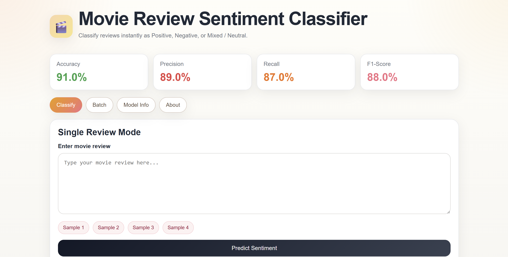
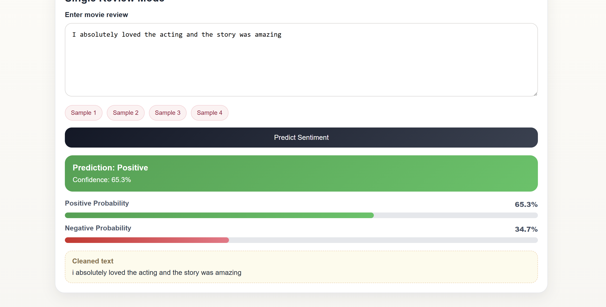
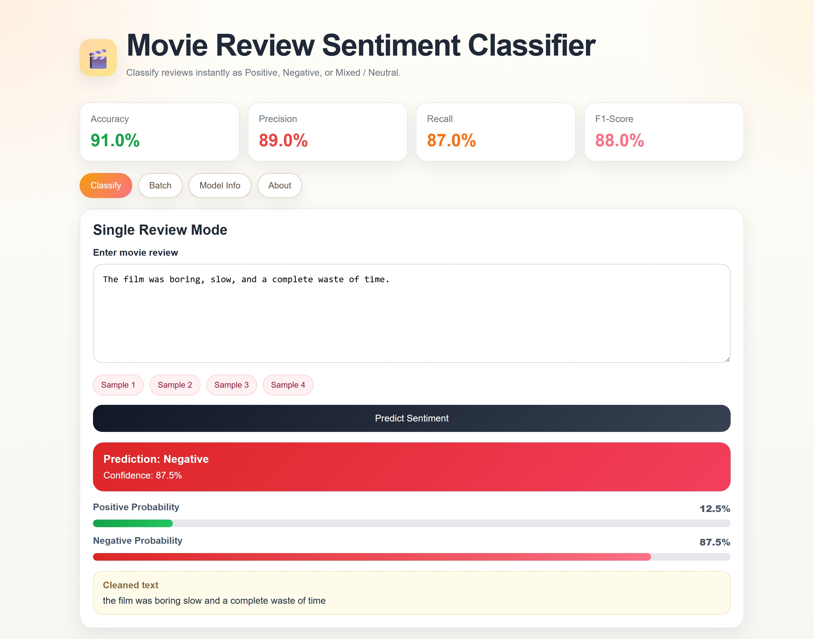
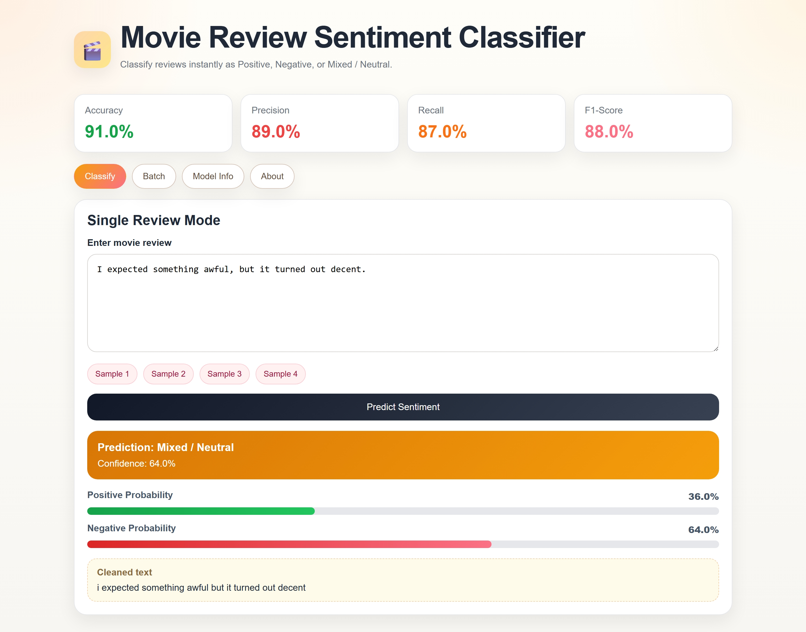
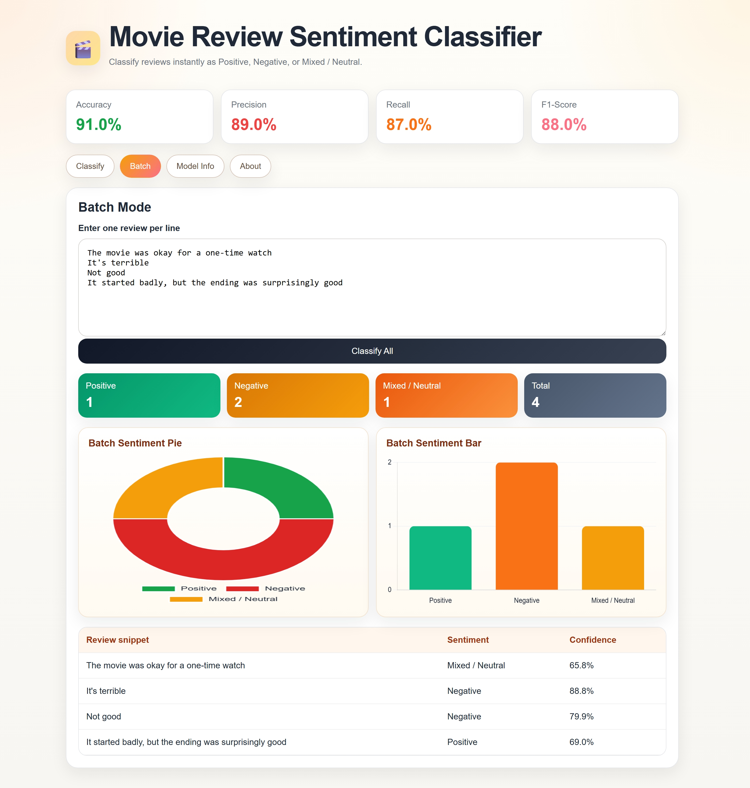
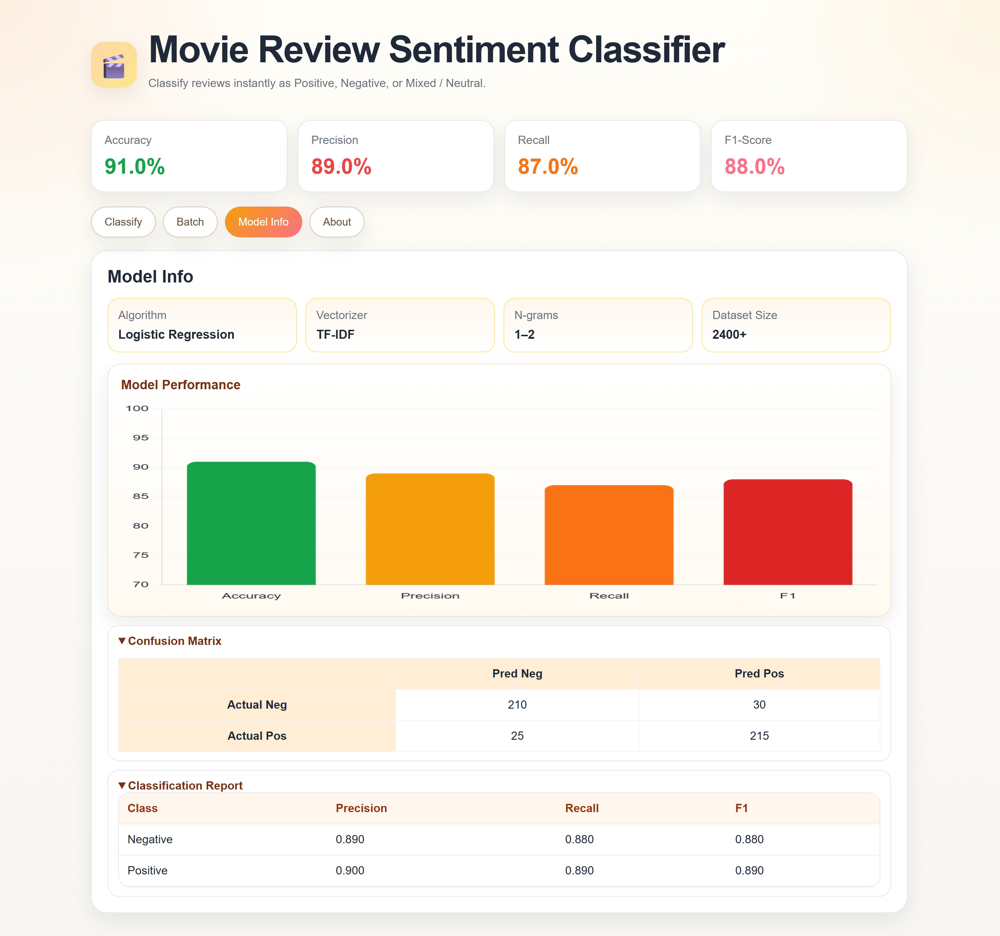

# 🎬 Movie Review Sentiment Classifier

A machine learning-powered web application that analyzes movie reviews and predicts whether the sentiment is **Positive**, **Negative**, or **Mixed / Neutral**.

Built using **Flask**, **TF-IDF Vectorization**, and **Logistic Regression**, with an interactive dashboard and visual analytics.

---

## ✨ Features

### 🔹 Single Review Analysis

* Enter a movie review
* Get sentiment prediction instantly
* View confidence score and probability distribution

### 🔹 Batch Review Analysis

* Analyze multiple reviews at once
* View results in a structured table
* Compare sentiments across reviews

### 🔹 Sentiment Categories

* Positive 😊
* Negative 😞
* Mixed / Neutral 😐

### 🔹 Interactive Dashboard

* Accuracy
* Precision
* Recall
* F1 Score

### 🔹 Visual Analytics

* Sentiment distribution charts
* Performance metrics visualization
* Confusion matrix display

### 🔹 Model Information

* Algorithm details
* Dataset statistics
* Classification report

---

## 🛠 Tech Stack

* Python
* Flask
* Pandas
* Scikit-learn
* Joblib
* HTML
* CSS
* JavaScript
* Chart.js

---

## 📂 Project Structure

movie_review_sentiment_project_plus_charts/

├── enhanced_app.py

├── train.py

├── requirements.txt

├── metrics.json

├── README.md

├── static/

├── templates/

├── screenshots/

├── data/

└── models/

---

## 🚀 Installation & Run

### Create Virtual Environment

```bash
python -m venv .venv
```

### Activate Environment

```bash
.venv\Scripts\activate
```

### Install Dependencies

```bash
python -m pip install --upgrade pip
python -m pip install -r requirements.txt
```

### Run Application

```bash
python enhanced_app.py
```

Open:

```bash
http://127.0.0.1:5000
```

---

## 📸 Screenshots

### Home Page


### Classification Example 1


### Classification Example 2


### Classification Example 3


### Batch Analysis


### Model Information

---

## 🎯 Applications

* Movie Review Analysis
* Social Media Monitoring
* Customer Feedback Analysis
* Product Review Classification
* Opinion Mining
---

## 👨‍💻 Author

**Mohana Jarajapu**

Artificial Intelligence & Machine Learning Student
